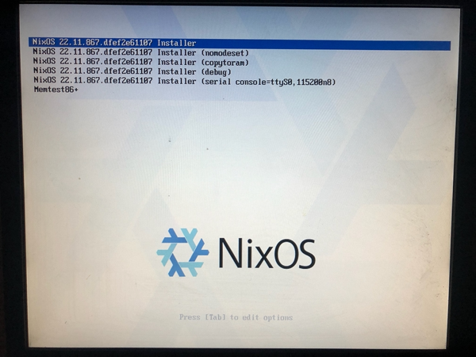
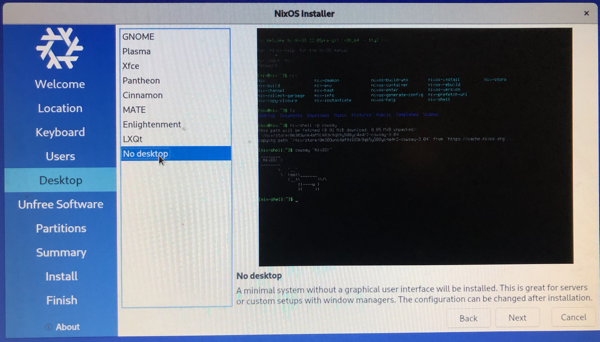
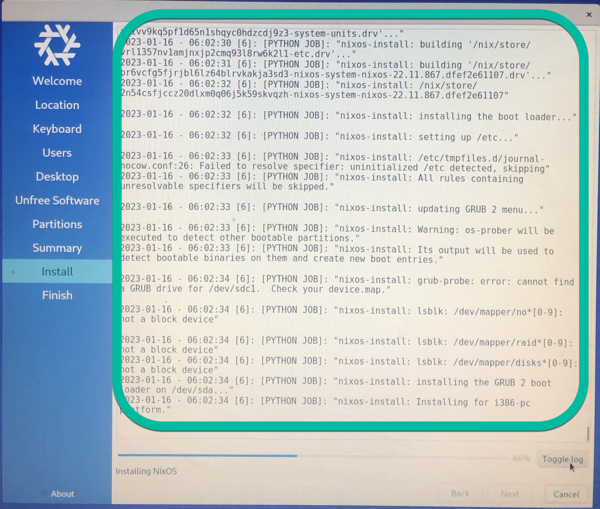
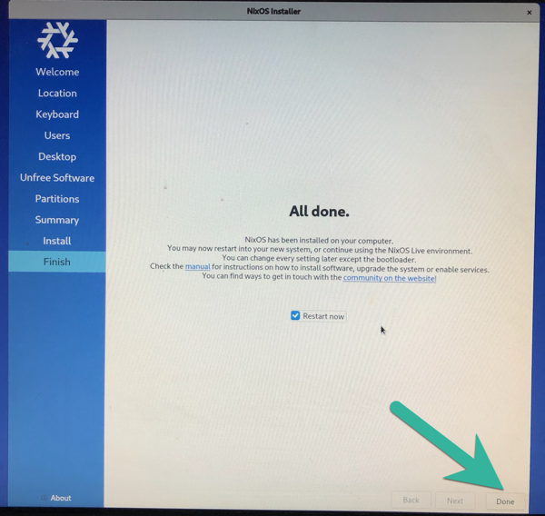

### Download and install NixOS

  MY₿ONK console runs on NixOS. You need to install NixOS. 

  Let's do it.

  A NixOS live CD image can be downloaded from the [NixOS download page](https://nixos.org/download.html#nixos-iso) to install from (make sure you scroll down to the bottom of their home page as the first half of it is about nix *package manager* not nixOS).
  
  Download the "*Graphical* ISO image", it is bigger than the "Minimal ISO image" but it will give you a good first experience using nixOS and will ease some configuration steps like setting up default keyboard layout and disk partitioning which are typical pain points for "not-so-experienced-users". NixOS' new installation wizard in the Graphical ISO image makes it so much more user-friendly.

  Flash the iso image on an USB stick using [balenaEtcher](https://www.balena.io/etcher/).
  
  Plug your MY₿ONK console to the power source and to your network switch using an RJ45 cable.

  Plug-in the screen, the keyboard and the mouse (use a wired mouse to avoid issues, some wireless ones don't work so great and the pointer may jerk around on the screen). These are **used only during this first guided installation procedure**, after this all interactions with the MY₿ONK console will be done "headless" via the MY₿ONK orchestrator as explained in section [Control your MY₿ONK fleet from MY₿ONK orchestrator](#3-basic-operations).

  

  Stick on USB stick in your MY₿ONK console.

  Switch MY₿ONK console on, keep pressing the ``<Delete>`` or ``<ESC>`` key on the keyboard during boot to access the BIOS settings.
  
  


  Make sure the following settings are set in the BIOS:
  
-  ``Boot mode select`` set to ``[Legacy]``
-  ``Boot Option #1`` set to ``USB Device: [USB]``

  

  Let your MY₿ONK console boot from the USB stick.

  

  After the welcome screen the first thing you are asked to configure is your Location, this is used to make sure the system is configured with the correct language and that the corresponding numbers and date formats are used, just choose the right one for you.

  

  The next screen is the keyboard layout selection, which is invariably a point people struggle with depending on what country they are from (azerty, querty ...) and also the variants that exist. **Take your time** trying a few (don't forget to try the special characters '@', '*', '_', '-', '/', ';', ':' .etc... ) until you find the best match. In my case it's "French" variant "French (Macintosh)". Not choosing the correct layout will result in keys inversions which will lead to you not being able to log in your system because the password you think you tap in does not actually enter the correct characters.

  
  
  Next you are going to create the users for the system. For now we create a user ```mybonk``` with password ```mybonk``` and we use the same password for the administrator account. 

  

  Next you are going to be asked what Desktop you want to have. We don't want a Desktop, select "No desktop". 

  

  Confirm "Unfree software" (read the reason behind this mentioned on the screen).
  


  Now we are going to configure the storage devices and partitions. MY₿ONK console has 2 built-in storage devices:
  - ```/dev/sda``` M1 mSATA 128GB SSD used for *system*: This is where the system boots from, where the operating system (and various caches) lives and where the swap space is allocated. 
  - ```/dev/sdb``` SATA 1TB SSD used for *states*: This is where the system settings, the bitcoin blockchain and installed software settings as well as user data is stored. The data on this drive *persisted*.


  

  As this is a fresh new install these drives should not contain any partitions. If there are any on either of the disks delete them by selecting "```New Partition Table```" (creating a new partition table will delete all data on the disk).
  Make sure you select "Master Boot Record (MBR)" instead of GUID Partition Table (GPT) when creating the new partition tables.
  


  Let's configure ```/dev/sda```:
  
  
  

  Let's configure ```/dev/sdb```:
  
  
  


  Now select "Next" to confirm the partitions that are going created (and possibly prior deleted).

  


  The installation takes less than one minute click on "Toggle Logs" at the bottom right of the splash screen it to see and understand how the OS is being pulled and installed.

  

  "All Done". Do **NOT** Unplug the USB stick just yet.

  Select "Restart now" and click on "Done"

  

  When MY₿ONK console is rebooting remove the USB stick it will then boot on the MBR of /dev/sda. Your system is now running by itself, let's continue its configuration.

  <div id="configuration.nix" ></div>
  After reboot login to MY₿ONK console as ```root``` password ```mybonk```.
  
  

