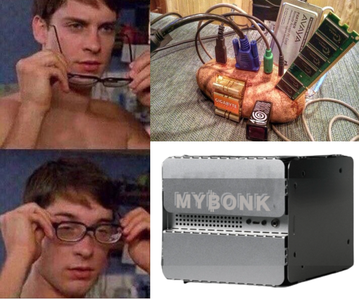

# FAQ - Frequently Asked Questions

  - [Can I install MYBONK stack on another hardware than MYBONK console?](#can-i-install-mybonk-stack-on-another-hardware-than-mybonk-console)
  - [How to verify a file or image downloaded from the Internet?](#howto-verify-a-file-or-image-downloaded-from-the-internet)
  - [Tell us more about the BONK token](#tell-us-more-about-the-bonk-token)
  - [Tell us more about Raspiblitz, Nodle, Ubrell and others](#tell-us-more-about-raspiblitz-nodle-brell-and-others)

---

## Can I install MYBONK core stack on another hardware than MYBONK console?

==100%==. 
Although MY₿ONK console has been designed specifically as a bitcoin-only full node with price, performance, durability, portability energy-efficience, supply chain resilience and generic parts in mind you can run the software stack on whatever hardware you deem suitable for purpose. 


However we focus our efforts at maintaining the code base with MY₿ONK console as hardware reference (it would be impossible to support all the hardware forms and shapes available on the market at any given time).


Running a MY₿ONK console allows you to be confident your system is identical to the one of the other MY₿ONK users, you won't be slow-down by common compatibility issues or missing drivers, you just don't have the required skills nor the time, you want it to work from the get go.




## How to verify a file or image downloaded from the Internet?

There are all sorts of risks and threats associated with files and images downloaded form the Internet. 
"Don't trust verify". This can be done by verifying files and images in two ways: verify its hash (proves integrity) or verify its signature (proves integrity and authenticity).

You can use the command 'shasum' to verify a hash, it must return the same hash as the one provided my the originator (often mentioned next to the download link). Below an example on how to check hash-256 of THE-FILE-YOU-DOWNLOADED

```
$ shasum -a 256 [THE-FILE-YOU-DOWNLOADED]
```

Verifying a hash hash proves integrity but not authenticity.

To verify authenticity (prove that the legitimate source signed it) you can use 'gpg'. 

To import the source public key:

```
curl --tlsv1.2 --proto '=https' https://keybase.io/mybonk/pgp_keys.asc | gpg --import
```

And run a verification on the data using the source's signature file.

```
gpg --verify [SIGNATURE-FILE] [THE-FILE-YOU-DOWNLOADED]
```

*You can ignore any warning about the key being 'not a trusted signature' or untrusted .. as long you see "good signature" and the correct main & sub fingerprints the download is valid.*

## Tell us more about the BONK token
We hear there are new tokens named BONK or MYBONK on the "market". It's not us. We are MY₿ONK. We don't do trading nor scamming nor ICOs. Leave us alone. mybonk-core is free and open source (MIT).

## Tell us more about Raspiblitz, Nodle, Ubrell, Step9 and all the others
Bitcoin is for everyone, but everyone goes at a different pace and is in a different phase in one's bitcoin adoption journey, there is no "one size fit all".
If unsure get advice on what "rabbit hole" would be best for you from other bitcoiners who know you and you trust.


Not ready to take the plunge? Why not start by having a look at the [baby rabbit holes](/docs/baby-rabbit-holes.md) :hole: :rabbit2: so you will be ready for when the time comes 


We all stand on the shoulders of giants and learn from one another. 
Enjoy the ride, no stress.
